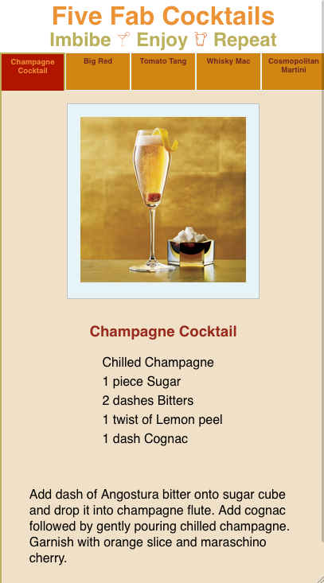

# Five Fab Cocktails

Cocktail anyone? Here are five cocktails for you to try.

Website: https://thwcorbin.github.io/five-fab-cocktails

Repo: https://github.com/ThwCorbin/five-fab-cocktails

## Description

The website presents a user five fab cocktails with tabs to select each one. User can click a button to load five more cocktails.

This is a lab exercise that I converted into a project for [General Assembly's](https://generalassemb.ly/ "General Assembly homepage") Software Engineering Immersive program.

## Technologies

- React
- JavaScript
- HTML
- CSS

## Installation

- Clone the repo: https://github.com/ThwCorbin/five-fab-cocktails

## Usage

- `cd` to the five-fab-cocktails directory
- open index.html in your browser(1)

## License

[MIT](LICENSE.txt "MIT License text file")

## Notes

Note 1: I use [Live Server](https://marketplace.visualstudio.com/items?itemName=ritwickdey.LiveServer "Live Server extension") to serve my program from my code editor, [VS Code](https://code.visualstudio.com/ "Visual Studio Code editor").
